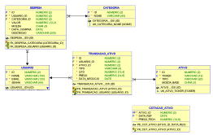
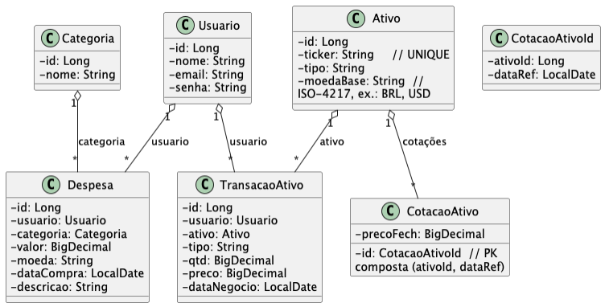

# Duck Bill

Aplicação Spring Boot para controle de despesas pessoais, desenvolvida em Java 21, utilizando JPA/Hibernate para persistência em Oracle Database. Destinada a jovens estudantes para rastrear gastos diários, converter moedas e obter relatórios básicos.

## Integrantes
- Bruno Carlos Soares RM 559250 - Responsável pelos testes funcionais e validação dos endpoints.
- Lucas Borges de Souza RM 560027 - Desenvolvimento completo da aplicação Spring Boot, controllers e serviços.
- Pedro Henrique Rodrigues RM 560393 - Criação da documentação, diagramas e README do projeto.


## Como Rodar
1. Clone o repositório.
2. Configure o banco Oracle em `src/main/resources/application.yml` (url, username, password).
3. Execute: `mvn spring-boot:run`
Após iniciar a aplicação, acesse a interface do Swagger UI para explorar e testar os endpoints da API:
   - URL : [http://localhost:8080/swagger-ui.html](http://localhost:8080/swagger-ui.html)

## Testes com Postman
Para testar os endpoints da API, importe a coleção do Postman localizada em `docs/postman/duckBill-postman.json`. A coleção inclui exemplos de requisições para todos os endpoints principais.
   

## Diagramas
### Diagrama ER (Entidade-Relacionamento)


### Diagrama de Classes


## Vídeo de Demonstração
[Link para vídeo mostrando proposta: app para estudantes controlar gastos, converter moedas, relatórios; público-alvo: jovens; problema: falta de controle financeiro]

## Endpoints Principais
- Usuários: POST/GET /api/v1/usuarios
- Categorias: POST/GET /api/v1/categorias
- Despesas: POST/GET /api/v1/despesas, GET /api/v1/despesas/top3, GET /api/v1/despesas/insights
- Ativos: POST/GET /api/v1/ativos, PUT/DELETE /api/v1/ativos/{id}
- Transações Ativo: POST/GET /api/v1/transacoes-ativo, PUT/DELETE /api/v1/transacoes-ativo/{id}
- Cotações de Ativo: POST/GET /api/v1/cotacoes-ativo, GET /api/v1/cotacoes-ativo/{ativoId}/{dataRef}
- Cotações de Moeda: GET /api/v1/cotacoes-moeda, GET /api/v1/cotacoes-moeda/{moeda}/{dataRef}
- Câmbio (serviço utilitário): GET /api/v1/cambio

## Testes Possíveis (via curl ou Postman)
### 1. Criar Usuário
```bash
curl -X POST http://localhost:8080/api/v1/usuarios \
  -H "Content-Type: application/json" \
  -d '{"nome":"João Silva","email":"joao@example.com","senha":"senha123"}'
```
Resposta esperada: {"id":1,"nome":"João Silva","email":"joao@example.com"}

### 2. Criar Categoria
```bash
curl -X POST http://localhost:8080/api/v1/categorias \
  -H "Content-Type: application/json" \
  -d '{"nome":"Alimentacao"}'
```
Resposta: {"id":1,"nome":"Alimentacao"}

### 3. Criar Despesa
```bash
curl -X POST http://localhost:8080/api/v1/despesas \
  -H "Content-Type: application/json" \
  -d '{"usuarioId":1,"categoriaId":1,"valor":50.00,"moeda":"BRL","dataCompra":"2023-10-01","descricao":"Jantar"}'
```
Resposta: {"id":1,"usuarioId":1,"categoriaId":1,"valor":50.0,"moeda":"BRL","dataCompra":"2023-10-01","descricao":"Jantar"}

### 4. Listar Despesas do Mês
```bash
curl -X GET "http://localhost:8080/api/v1/despesas?usuarioId=1&mes=2023-10"
```
Resposta: Lista de despesas do mês.

### 5. Top 3 Categorias por Gasto
```bash
curl -X GET "http://localhost:8080/api/v1/despesas/top3?usuarioId=1&mes=2023-10"
```
Resposta: [{"categoria":"Alimentacao","total":50.0}]

### 6. Insights Básicos
```bash
curl -X GET "http://localhost:8080/api/v1/despesas/insights?usuarioId=1&mes=2023-10"
```
Resposta: ["Você gasta 100% em Alimentacao. Vale reduzir?"]

### 7. Converter Moeda (via AwesomeAPI)
```bash
curl -X GET "http://localhost:8080/api/v1/cambio?from=USD&to=BRL&valor=100"
```
Resposta: {"valor":100,"to":"BRL","from":"USD","convertido":536.16}

### 8. Criar Ativo (Investimentos)
```bash
curl -X POST http://localhost:8080/api/v1/ativos \
  -H "Content-Type: application/json" \
  -d '{"ticker":"PETR4.SA","tipo":"STOCK","moedaBase":"BRL"}'
```
Resposta: {"id":1,"ticker":"PETR4.SA","tipo":"STOCK","moedaBase":"BRL"}

### 9. Criar Transação Ativo
```bash
curl -X POST http://localhost:8080/api/v1/transacoes-ativo \
  -H "Content-Type: application/json" \
  -d '{"usuarioId":1,"ativoId":1,"tipo":"BUY","qtd":10.0,"preco":25.50,"dataNegocio":"2023-10-01"}'
```
Resposta: Detalhes da transação.

### 10. Buscar Cotação Moeda
```bash
curl -X GET "http://localhost:8080/api/v1/cotacoes-moeda?moeda=USD&dataRef=2023-10-01"
```
Resposta: Cotação do dia.

## Cronograma
- Semana 1: Entidades/CRUD básicos (Sprint 1 - Maturity Level 1)
- Semana 2: Relatórios/Conversão de Moedas/Investimentos
- Semana 3: Testes/Documentação/Finalização

## Gestão e Configuração
- Repositório público no GitHub.
- Configuração via application.properties (Oracle, AwesomeAPI).
- Postman collection em docs/postman/duckBill-postman.json.
